<div align="center">

<!-- ANIMATED TYPING HEADER -->


<br/>

<!-- ANIMATED PIXEL SCENE (SVG file = GitHub renders animations) -->


<br/>

<!-- BADGES -->


</div>

---

## 🏰 About This Quest

> *"Every great journey begins with a single scroll..."*

This is my **personal portfolio website** — a pixel-art RPG-themed interactive experience built with **React 19 + Vite 8 + Tailwind CSS v4**.

Instead of a boring resume, I turned my portfolio into an **RPG side-scroller** complete with:

| Feature | Description |
|---|---|
| ⚔️ Walking Knight | Follows your scroll progress across the page |
| 🔥 Torch Effects | Real-time flickering lighting in a dungeon environment |
| 🌿 Falling Leaves | Animated leaves & swaying vines along the sides |
| 🎮 RPG UI | Skill bars, stat cards, and dialogue boxes |
| 🌙 Atmosphere | Pixel clouds, star fields, and CRT scanlines |
| 🗺️ Stage Navigation | INTRO → HERO → SKILLS → QUESTS → CONTACT |

---

## 📜 Tech Stack

| Rune | Spell | Version |
|------|-------|---------|
| ⚛️ React | UI Component Engine | 19 |
| ⚡ Vite | Build & Dev Server | 8 |
| 🎨 Tailwind CSS | Utility Styling | v4 |
| 📝 TypeScript | Type Magic | 5.7 |
| 🖋️ Press Start 2P | Pixel Font | Google Fonts |
| 🎵 VT323 | Retro Body Font | Google Fonts |

---

## ⚔️ Skill Tree

```
React / TypeScript  ████████████████████░░  95 / 100
Node.js / Backend   ██████████████████░░░░  88 / 100
UI / Design         ██████████████████░░░░  90 / 100
WebGL / Three.js    ██████████████░░░░░░░░  72 / 100
DevOps / Cloud      ████████████████░░░░░░  80 / 100
Rust / Systems      █████████████░░░░░░░░░  65 / 100
```

---

## 🗺️ Quest Log

```
╔══════════════════════════════════════════════════════╗
║  [STAGE 1] 🏰  INTRO     — Hero landing with stats  ║
║  [STAGE 2] 👾  HERO BIO  — Character sheet + lore   ║
║  [STAGE 3] ⚔️  SKILLS    — Skill tree allocator     ║
║  [STAGE 4] 🗺️  QUESTS    — Project showcase         ║
║  [STAGE 5] 📡  CONTACT   — Send a message           ║
╚══════════════════════════════════════════════════════╝
```

---

## 🚀 Getting Started

```bash
# Clone the dungeon
git clone https://github.com/jonathanhsa/portofolio-jonathan-hs.git
cd portofolio-jonathan-hs

# Install spells (dependencies)
pnpm install

# Enter the dev realm
pnpm dev
# → http://localhost:8443
```

---

## 📡 Contact the Wizard

<div align="center">

[](https://github.com/jonathanhsa)
&nbsp;
[](https://github.com/jonathanhsa/portofolio-jonathan-hs)

</div>

---

<div align="center">

```
  ⚔️  © 2024 JONATHAN H. SARAGIH  ⚔️
     BUILT PIXEL BY PIXEL · JAKARTA ID

    ★  INSERT COIN TO CONTINUE  ★
```


</div>
